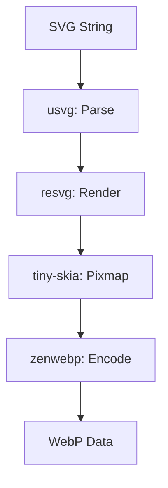
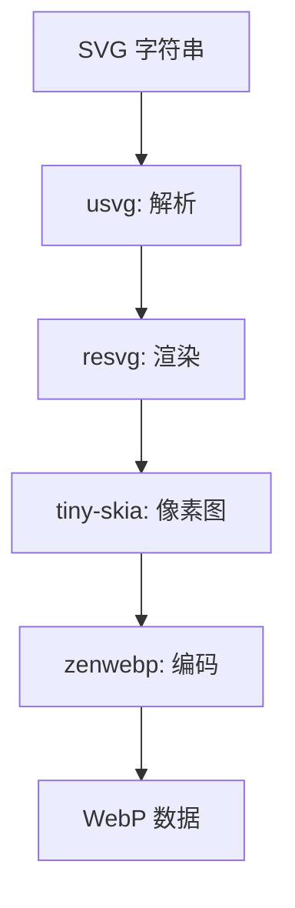

[English](#en) | [中文](#zh)

---

<a id="en"></a>

# svg2webp : Convert SVG to WebP

- [Introduction](#introduction)
- [Usage](#usage)
- [Features](#features)
- [Design](#design)
- [Tech Stack](#tech-stack)
- [Directory Structure](#directory-structure)
- [API](#api)
- [History](#history)

## Introduction

High-performance library for converting SVG data to WebP format.

## Usage

```rust
use svg2webp::svg2webp;

fn main() -> Result<(), Box<dyn std::error::Error>> {
  let svg = r#"<svg ...>...</svg>"#;
  let quality = 75;
  let webp = svg2webp(svg, quality)?;
  std::fs::write("output.webp", webp)?;
  Ok(())
}
```

## Features

- Fast SVG parsing and rendering.
- High-quality WebP encoding.
- Simple API.

## Design



Call flow:

1. Parse SVG string into `usvg::Tree`.
2. Initialize `tiny-skia::Pixmap` with SVG size.
3. Fill background with white.
4. Render `usvg::Tree` onto `Pixmap` via `resvg`.
5. Encode raw pixel data into WebP using `zenwebp`.

## Tech Stack

- `usvg`: SVG parsing and preprocessing.
- `resvg`: SVG rendering logic.
- `tiny-skia`: 2D graphics library backend.
- `zenwebp`: WebP encoding wrapper.

## Directory Structure

```text
.
├── Cargo.toml
├── readme/
│   ├── en.md
│   └── zh.md
├── src/
│   ├── error.rs
│   └── lib.rs
└── tests/
    └── main.rs
```

## API

### `svg2webp`

```rust
pub fn svg2webp(svg: impl AsRef<str>, quality: u8) -> Result<Box<[u8]>, Error>
```

Converts SVG string to WebP bytes.

- `svg`: Input SVG string.
- `quality`: Encoding quality (0-100).

## History

WebP format was announced by Google in 2010, leveraging the VP8 video codec's intra-frame compression to achieve significantly smaller file sizes than JPEG and PNG. SVG, on the other hand, emerged in the late 1990s as a consensus between competing proposals like VML and PGML. This library facilitates the transition from the XML-based vector world to the highly optimized raster world of the modern web.

---

## About

This project is an open-source component of [i18n.site ⋅ Internationalization Solution](https://i18n.site).

* [i18 : MarkDown Command Line Translation Tool](https://i18n.site/i18)

  The translation perfectly maintains the Markdown format.

  It recognizes file changes and only translates the modified files.

  The translated Markdown content is editable; if you modify the original text and translate it again, manually edited translations will not be overwritten (as long as the original text has not been changed).

* [i18n.site : MarkDown Multi-language Static Site Generator](https://i18n.site/i18n.site)

  Optimized for a better reading experience

---

<a id="zh"></a>

# svg2webp : SVG 转 WebP 工具库

- [项目功能介绍](#项目功能介绍)
- [使用演示](#使用演示)
- [特性介绍](#特性介绍)
- [设计思路](#设计思路)
- [技术堆栈](#技术堆栈)
- [目录结构](#目录结构)
- [API 说明](#api-说明)
- [技术背景](#技术背景)

## 项目功能介绍

将 SVG 数据高效转换为 WebP 格式。

## 使用演示

```rust
use svg2webp::svg2webp;

fn main() -> Result<(), Box<dyn std::error::Error>> {
  let svg = r#"<svg ...>...</svg>"#;
  let quality = 75;
  let webp = svg2webp(svg, quality)?;
  std::fs::write("output.webp", webp)?;
  Ok(())
}
```

## 特性介绍

- 快速解析与渲染 SVG。
- 高质量 WebP 编码。
- 接口简洁。

## 设计思路



调用流程：

1. 将 SVG 字符串解析为 `usvg::Tree`。
2. 根据 SVG 尺寸初始化 `tiny-skia::Pixmap`。
3. 填充白色背景。
4. 使用 `resvg` 将 `usvg::Tree` 渲染至 `Pixmap`。
5. 通过 `zenwebp` 将像素数据编码为 WebP。

## 技术堆栈

- `usvg`: SVG 解析与预处理。
- `resvg`: SVG 渲染逻辑。
- `tiny-skia`: 二维图形库后端。
- `zenwebp`: WebP 编码封装。

## 目录结构

```text
.
├── Cargo.toml
├── readme/
│   ├── en.md
│   └── zh.md
├── src/
│   ├── error.rs
│   └── lib.rs
└── tests/
    └── main.rs
```

## API 说明

### `svg2webp`

```rust
pub fn svg2webp(svg: impl AsRef<str>, quality: u8) -> Result<Box<[u8]>, Error>
```

将 SVG 字符串转换为 WebP 字节流。

- `svg`: 输入 SVG 字符串。
- `quality`: 编码质量 (0-100)。

## 技术背景

WebP 格式由 Google 于 2010 年发布，其核心技术源自 VP8 视频编码的帧内压缩算法，在保持画质的同时大幅缩小了文件体积。SVG 的诞生则可以追溯到上世纪 90 年代末，是 W3C 在平衡了 VML 与 PGML 等多个竞争方案后达成的共识。本项目旨在连接矢量图的灵活性与现代网页图像的高效性。

---

## 关于

本项目为 [i18n.site ⋅ 国际化解决方案](https://i18n.site) 的开源组件。

* [i18 : MarkDown 命令行翻译工具](https://i18n.site/i18)

  翻译能够完美保持 Markdown 的格式。能识别文件的修改，仅翻译有变动的文件。

  Markdown 翻译内容可编辑；如果你修改原文并再次机器翻译，手动修改过的翻译不会被覆盖 （ 如果这段原文没有被修改 ）。

* [i18n.site : MarkDown 多语言静态站点生成器](https://i18n.site/i18n.site) 为阅读体验而优化。
