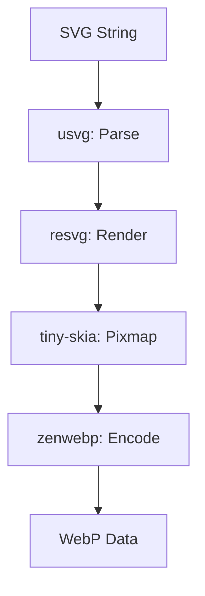

# svg2webp : Convert SVG to WebP

- [Introduction](#introduction)
- [Usage](#usage)
- [Features](#features)
- [Design](#design)
- [Tech Stack](#tech-stack)
- [Directory Structure](#directory-structure)
- [API](#api)
- [History](#history)

## Introduction

High-performance library for converting SVG data to WebP format.

## Usage

```rust
use svg2webp::svg2webp;

fn main() -> Result<(), Box<dyn std::error::Error>> {
  let svg = r#"<svg ...>...</svg>"#;
  let quality = 75;
  let webp = svg2webp(svg, quality)?;
  std::fs::write("output.webp", webp)?;
  Ok(())
}
```

## Features

- Fast SVG parsing and rendering.
- High-quality WebP encoding.
- Simple API.

## Design



Call flow:

1. Parse SVG string into `usvg::Tree`.
2. Initialize `tiny-skia::Pixmap` with SVG size.
3. Fill background with white.
4. Render `usvg::Tree` onto `Pixmap` via `resvg`.
5. Encode raw pixel data into WebP using `zenwebp`.

## Tech Stack

- `usvg`: SVG parsing and preprocessing.
- `resvg`: SVG rendering logic.
- `tiny-skia`: 2D graphics library backend.
- `zenwebp`: WebP encoding wrapper.

## Directory Structure

```text
.
├── Cargo.toml
├── readme/
│   ├── en.md
│   └── zh.md
├── src/
│   ├── error.rs
│   └── lib.rs
└── tests/
    └── main.rs
```

## API

### `svg2webp`

```rust
pub fn svg2webp(svg: impl AsRef<str>, quality: u8) -> Result<Box<[u8]>, Error>
```

Converts SVG string to WebP bytes.

- `svg`: Input SVG string.
- `quality`: Encoding quality (0-100).

## History

WebP format was announced by Google in 2010, leveraging the VP8 video codec's intra-frame compression to achieve significantly smaller file sizes than JPEG and PNG. SVG, on the other hand, emerged in the late 1990s as a consensus between competing proposals like VML and PGML. This library facilitates the transition from the XML-based vector world to the highly optimized raster world of the modern web.
